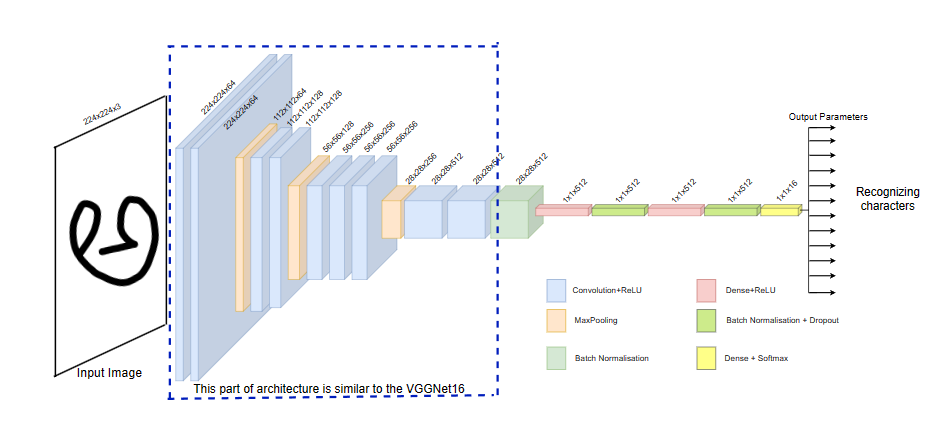

# Machine Learning Project

## Kannada Handwritten Character Recognition using Transfer Learning Approach

### Problem Statement

Handwritten character recognition is a crucial process that involves converting handwritten text on different surfaces, such as paper and postcards, into digital formats, making it distinguishable from scanned images. Remarkable advancements have been made in this field, particularly in India, where many languages with complex scripts like Kannada, English, and Marathi are used.

Kannada is one of the widely used languages in southern India, and recognizing its handwritten characters is challenging due to its complicated script. The project aims to tackle this challenge using a Deep Learning approach, specifically focusing on Convolutional Neural Networks (CNN) and transfer learning techniques.

### Approach

The project utilizes a Transfer Learning approach, leveraging pre-trained CNN models to recognize Kannada handwritten characters efficiently. Transfer learning allows us to benefit from the knowledge gained by training models on large datasets such as ImageNet, making it easier to train accurate models with smaller datasets.

The data set used for experimentation is sourced from Kaggle, consisting of 16 classes of 25 images each. This dataset provides a diverse range of Kannada handwritten characters for training and testing the model.

### Architecture

This diagram illustrates the overall architecture of the Kannada Handwritten Character Recognition system using Transfer Learning approach, showcasing the flow of data, model layers, and key components.

### Results

After training the CNN model using transfer learning techniques, the project achieved an impressive accuracy of 97.50% in just 50 epochs. This high accuracy demonstrates the potential of CNN networks in character recognition tasks, particularly in challenging scripts like Kannada.

### Conclusion

The project's success in Kannada handwritten character recognition not only contributes to technological advancements but also helps in preserving historical documents and cultural heritage. The versatile nature of the machine learning model extends its applications beyond Kannada, showcasing its potential in various fields of technology development.

By sharing this project on GitHub, we aim to encourage collaboration, further research, and innovation in the field of machine learning and character recognition.
